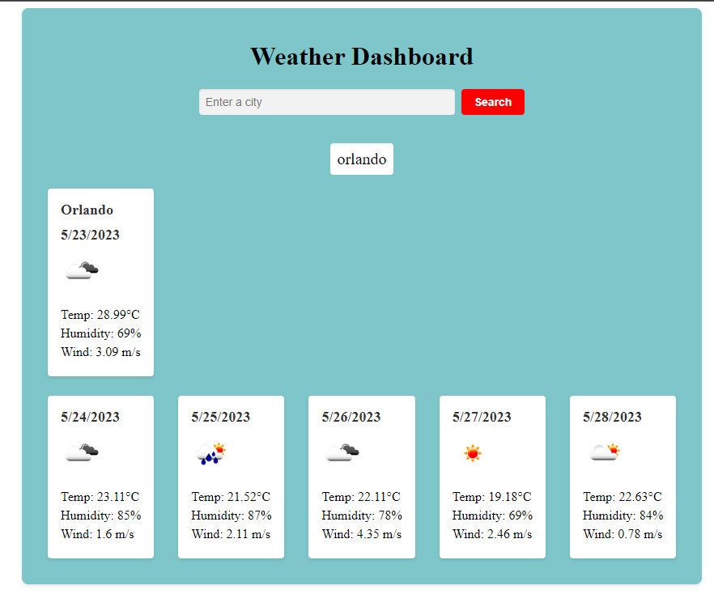

# Weather Dashboard
<a href="https://github.com/mandaark17/weather-dash">Git Link</a>

<a href="https://mandaark17.github.io/weather-dash/">Website Link</a>

## Description

This application will help people plan ahead with lightning speed for the forecasted weather to the desired dcestination. Also, the weather save the history of the previous cities searched so that they can be compared. Later it can be adjusted to display both.

I struggled for a very long time looking for a bug in the code on the tempurature fetch, all to discover that the UTC did not like my copy and pasted character of "degrees", so I found the alternative online and fixed it finally. The website could look a bit more polished with things less center, however, I underestimated how strange it would be to input data from the API and dynamically appending the elements from that data.

## Installation

No installation required!

## Credits
Self made application with help with fetching syntax from usual method of documentation.

## License

MIT License
